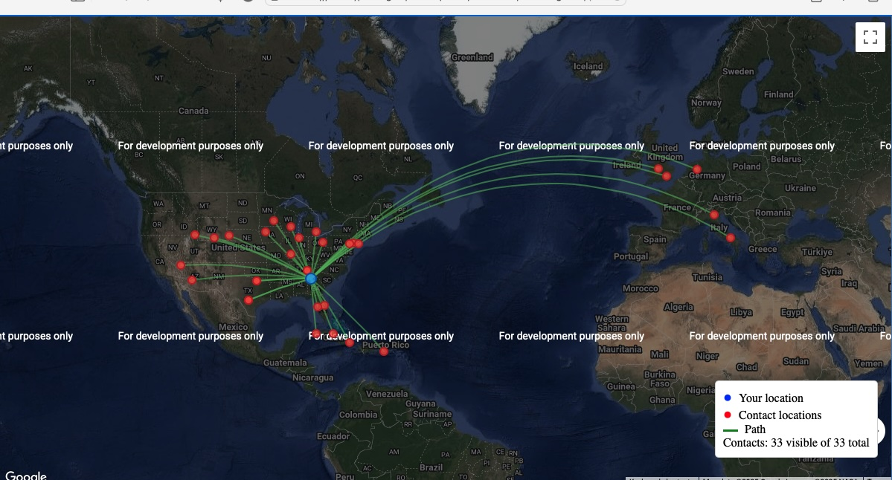

# Ham Radio Contact Mapper

## Note
*This application was started as an experiment to see how well Anthropic's Claude AI could generate code.
The README text below was generated by the AI as was most of the code.  I had to hand code the ADIF parser after 3 attempts using the AI.*  

Below is the current state of the code's output without using a Google API key:  



## Overview
This Python program maps amateur radio contacts from ADIF (Amateur Data Interchange Format) files to Google Maps. It translates Maidenhead grid square coordinates to latitude and longitude coordinates that can be used with the Google Maps API. The program also displays paths between your location and each contact.

## Features
- Parse ADIF files containing ham radio contacts
- Convert Maidenhead grid squares to latitude/longitude coordinates
- Create interactive Google Maps with contact markers
- Display paths between your location and each contact
- View contact details by clicking on markers
- Modular design with separate files for different functionality
- Configurable settings via JSON file

## Project Structure
- **main.py** - Entry point that runs the application
- **adif_parser.py** - Module to read and parse ADIF files
- **grid_converter.py** - Module to convert Maidenhead grid coordinates to lat/long
- **maps_interface.py** - Module to interact with Google Maps API
- **settings.py** - Store configuration settings

## Installation

1. Clone or download the repository
2. Install Python 3.x if not already installed
3. No additional Python packages are required

## Google Maps API Key

To use this application, you'll need a Google Maps API key:

1. **Create a Google Cloud Platform account**
   - Go to the Google Cloud Console (https://console.cloud.google.com/)
   - Sign in with your Google account or create one if needed

2. **Create a new project**
   - Click on the project dropdown at the top of the page
   - Click "New Project"
   - Enter a name for your project and click "Create"

3. **Enable the Maps JavaScript API**
   - From your dashboard, navigate to "APIs & Services" > "Library"
   - Search for "Maps JavaScript API"
   - Click on it and then click "Enable"

4. **Create credentials**
   - Go to "APIs & Services" > "Credentials"
   - Click "Create Credentials" > "API key"
   - Your new API key will be displayed

5. **Restrict your API key (recommended for security)**
   - In the credentials page, find your API key and click "Edit"
   - Under "Application restrictions," you can set it to "HTTP referrers" and specify which websites can use this key
   - Under "API restrictions," select "Maps JavaScript API" to restrict the key to only this API
   - Click "Save"

## Configuration

Create a `settings.json` file in the same directory as the application files with the following structure:

```json
{
    "DEFAULT_ADIF_FILE": "contacts.adi",
    "OUTPUT_DIRECTORY": "maps",
    "GOOGLE_MAPS_API_KEY": "YOUR_API_KEY_HERE",
    "DEFAULT_MAP_TYPE": "HYBRID",
    "AUTO_OPEN_MAP": true,
    "OPERATOR_GRIDSQUARE": "FN31pr"
}
```

Configuration options:
- `DEFAULT_ADIF_FILE`: Default ADIF file to use if none is specified
- `OUTPUT_DIRECTORY`: Directory to save generated map HTML files
- `GOOGLE_MAPS_API_KEY`: Your Google Maps API key
- `DEFAULT_MAP_TYPE`: Map type to display (ROADMAP, SATELLITE, HYBRID, or TERRAIN)
- `AUTO_OPEN_MAP`: Whether to automatically open maps in browser
- `OPERATOR_GRIDSQUARE`: Your grid square location (optional, will look for MY_GRIDSQUARE in ADIF file if not specified)

## Usage

Run the program by executing the main.py file:

```
python main.py [path_to_adif_file]
```

If no ADIF file is specified, the program will use the default file specified in settings.

## About ADIF Format

ADIF (Amateur Data Interchange Format) is a standard format for exchanging amateur radio contact information. Most ham radio logging software can export logs in ADIF format.

The program looks for the following fields in the ADIF file:
- `CALL`: Callsign of the contact
- `NAME`: Name of the contact
- `QSO_DATE`: Date of the contact
- `TIME_ON`: Time of the contact
- `BAND`: Frequency band
- `MODE`: Contact mode (e.g., SSB, FT8, CW)
- `GRIDSQUARE`: Grid square of the contact
- `MY_GRIDSQUARE`: Your grid square

## About Maidenhead Grid System

The Maidenhead Locator System (also known as grid squares or grid locators) is a geographic coordinate system used by amateur radio operators. It divides the world into grid squares with a combination of letters and numbers, such as "FM18lw".

## Output

The program generates an HTML file with Google Maps displaying:
- A marker for your location (blue circle)
- Markers for each contact (red circles)
- Paths connecting your location to each contact (green lines)

Clicking on a marker shows details such as:
- Callsign
- Name (if available)
- Date and time of contact
- Band and mode
- Grid square

The generated HTML file will be saved in the specified output directory.

## Notes

- Google Maps Platform offers a $200 monthly credit, which is enough for most personal projects
- Usage beyond the free credit will incur charges, so restrict your API key appropriately
- If your ADIF file doesn't contain the `MY_GRIDSQUARE` field, you can set your grid square in the settings file